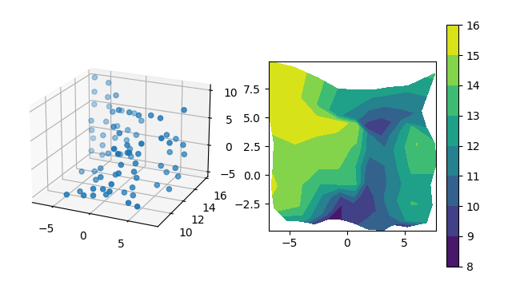

# Section 3+4, Mini Project 2
Elisa Dhanger, Jennifer Lee, Luke Nonas-Hunter

## Abstract
In this project, we were tasked to create a mechanism that could scan a 3D object...

## Code
### Software Architecture
Before we even opened our computers to start coding, we all sat in front of a whiteboard and created a system diagram for the software architecture.

Durring the discussion of our software architecture, we decided we wanted to do as much processing in python as possible and have the Arduino act only as a bridge between Python and the physical components of the scanner. If we compare our scanner to a human body, then the python code would be like the brain, the Arduino would be the spinal cord/sensor neurons, the infrared distance sensor would be the eyes, and the servos would be the muscles. The python code would gather information from the user (like image resolution) and generate all the servo positions for each point in the final image. Then it would individually send those servo positions to the Arduino, wait for the Arduino to update the servos, and finally ask the Arduino to collect data from the IR distance sensor and send it back to Python using serial communication. Python would repeat these steps for every servo position. Once all the data has been collected, python would convert the raw data into meaningful measurements using a calibration curve we created and graph all the scanned points on a 3 axis plot which it presents to the user. To make it easier to code all the different tasks Python needed to be responsible for, we divided the tasks into three main grous: setup, communication, and visualization. If we expand on our human body analogy, the different parts of the Python code could be thought of as the different parts of the brain where each part specializes in a different function and all need to work together inorder to for the system to function. 

In reflection, we found it incredibly helpful to have defined the system architecture so early in the project. Aside from it allowing us to divide the coding work up between the three of us and work on it in parallel, it made the integration process much less painful because the inputs, outputs, and responsibilities of each code section was clearly defined.  

### Implementing Arduino-Python Communication
Once we started coding, we decided to start by tackeling the Arduino-Python communication. We started implementing this first because it felt like the most mission-critical piece to us.

We start by just trying to get Python to send a message to the Arduino and have the Arduino blink a light when it recieved a message.

```python
import serial
import time

arduino = serial.Serial(port="/dev/ttyACM4", baudrate=115200, timeout=5)

while True:
    for _ in range(25):
        arduino.write(bytes("TEST MESSAGE", 'utf-8'))
    time.sleep(3)
```

```c++
void setup() {
    /* The setup function starts serial communcation, sets up a debug LED.
     */
    Serial.begin(115200);
    Serial.flush();
    pinMode(LED_BUILTIN, OUTPUT);
    digitalWrite(LED_BUILTIN, LOW);
}

void loop() {
    /* The main loop reads incoming serial messages. If a message is detected in the
     * input buffer, an LED is blinked on.
     */
    if (Serial.available() > 0) {
        digitalWrite(LED_BUILTIN, HIGH);
        delay(100)
    } else {
        digitalWrite(LED_BUILTIN, LOW);
    }
}
```

Once we were successfully recieving a message from the arduino, we wrote code so the arduino could respond to these messages.

```python
import serial
import time

arduino = serial.Serial(port="/dev/ttyACM4", baudrate=115200, timeout=5)

while True:
    for _ in range(25):
        arduino.write(bytes("TEST MESSAGE", 'utf-8'))
        print(arduino.read_until(bytes("\r\n", 'utf-8')).decode("utf-8"))
    time.sleep(3)
```

```c++
void sendMessage(String messageData) {
    /* Send a message to python using serial
     * 
     * Parameters:
     * messageData (String): the message data to be sent.
     */
    Serial.println(messageData);
}

void setup() {
    /* The setup function starts serial communcation, sets up a debug LED.
     */
    Serial.begin(115200);
    Serial.flush();
    pinMode(LED_BUILTIN, OUTPUT);
    digitalWrite(LED_BUILTIN, LOW);
}

void loop() {
    /* The main loop reads incoming serial messages. If a message is detected in the
     * input buffer, an LED is blinked on.
     */
    if (Serial.available() > 0) {
        digitalWrite(LED_BUILTIN, HIGH);
        String message = Serial.readStringUntil('\n');
        sendMessage(message);
    } else {
        digitalWrite(LED_BUILTIN, LOW);
    }
}
```

Getting to this point was super exciting for our team. This was the core mechanism behind our system and having it working felt great. At this point, we spent some time trying implement some best practices when it comes to writing in Python. We grouped our code into reusable classes and functions, wrote comments, utilized the `logging` Python package to add some debug statements to our code, and added `raise` statements to catch if there were any unexpected values trying to be sent or recieved over serial.

We also spent some time formalizing the message protocol we wanted to use. We decided that every message was going to start with a message type. The type would be represented by one character that indicated the kind of data that was going to follow. `'M'` meant that the message contained servo positions, `'S'` meant the message was trying to request IR distnce sensor data, and `'T'` was a test message with arbitrary data to check serial communication was working properly. Each message would also end with a specific series of end-of-message characters, specifically, `'\r\n'`. We choose these characters because they are automatically printed to the serial bus by the Arduino when using the `Serial.println()` function.

At this point our code looked something like this:
```python
import time
import logging
import logging.config
import serial

logger_path = os.path.join(os.path.dirname(os.path.abspath(__file__)), 'logging.conf')
logging.config.fileConfig(logger_path, disable_existing_loggers=False)
logger = logging.getLogger(__name__)
logger.setLevel(logging.DEBUG)

class Communication():
    """Infrastructure for serial communication with the Arduino."""

    EOM = "\r\n"
    SEND_MESSAGE_TYPES = ["M", "S", "T"]
    RECIEVE_MESSAGE_TYPES = ["M", "S","T"]

    def __init__(self, baudrate=115200, port="/dev/ttyACM4"):
        """Instantiate a Communication object.

        Parameters:
            baudrate (int): the baudrate of the serial port. This should match the
                baudrate set on the arduino.
            port (str): the serial port where the arduino is connected.
        """        

        logger.info("Starting communication with Arduino...")
        self.arduino = serial.Serial(port=port, baudrate=baudrate, timeout=5)
        time.sleep(5)
        self.arduino.flush()
        response = self.send_recieve("T","12345")
        if response["data"] == "12345":
            logger.info("Serial communication ready!")
        else:
            logger.info(f"ERROR: {response}")
   

    def send(self, message_type, message_data):
        """Send data to the arduino.

        Parameters:
            message_type (str): the message type. Must be a type listed in the send
                message type list stored in the communications class.
            message_data (str): data to be send over the serial bus to the arduino.
        
        Raises:
            ValueError: when the message type does not match a message type listed
                in the SEND_MESSAGE_TYPES list.
        """
        if message_type not in self.SEND_MESSAGE_TYPES:
            raise ValueError(f"Incorrect message type: {message_type}")
        message = f"{message_type}{message_data}{self.EOM}"
        self.arduino.write(bytes(message, 'utf-8'))
        
        
    def receive(self):
        """Receive data from the arduino.

        Returns:
            (dict): contains message type, processed data, and error value.
        """
        raw_data = self.arduino.read_until(bytes(self.EOM, 'utf-8')).decode("utf-8") 
        try:
            message_type = raw_data[0]
        except IndexError:
            return {
                "message_type": "ERROR",
                "data": "EMPTY",
                "error": 2,
            }
        if message_type in self.RECIEVE_MESSAGE_TYPES:
            data = raw_data.split("\n")[0].split("\r")[0][1:]
            return {
                "message_type": message_type,
                "data": data,
                "error": 0,
            }
        else:
            return {
                "message_type": "ERROR",
                "data": raw_data,
                "error": 1,
            }
    
    def send_recieve(self, message_type, message_data):
        """Send data and expect a response.

        Parameters:
            message_type (str): the message type. Must be a type listed in the send
                message type list stored in the communications class.
            message_data (str): data to be send over the serial bus to the arduino.
        Returns:
            (dict): contains message type, processed data, and error value.
        """
        self.send(message_type, message_data)
        response = self.receive()
        if response["message_type"] != message_type:
            raise ValueError(f"Unexpected message type. Message: {response}")
        return response
```

```c++
#define TYPE_INDEX 0
#define DATA_INDEX 1

void sendMessage(char messageType, String messageData) {
    /* Send a message to python using serial
     * 
     * Parameters:
     *  messageType (char): the type of the message. Examples include, 'M' for
     *      motor response, 'S' for sensor response, or 'T' for test.
     * messageData (String): the message data to be sent.
     */
    Serial.print(messageType);
    Serial.println(messageData);
}

void setup() {
    /* The setup function starts serial communcation, sets up a debug LED.
     */
    Serial.begin(115200);
    Serial.flush();
    pinMode(LED_BUILTIN, OUTPUT);
    digitalWrite(LED_BUILTIN, LOW);
}

void loop() {
    /* The main loop reads incoming serial messages. If a message is detected in the
     * input buffer, an LED is blinked on.
     */
    if (Serial.available() > 0) {
        digitalWrite(LED_BUILTIN, HIGH);
        String message = Serial.readStringUntil('\n');
        char messageType = message.charAt(TYPE_INDEX);
        String data = message.substring(DATA_INDEX);
        sendMessage(message);
    } else {
        digitalWrite(LED_BUILTIN, LOW);
    }
}
```

### Controlling Servos & Getting IR Distance Data
Our next step was to write Arduino code that would either set servo positions or read the IR distance sensor. However, before we could start messing around with the sensor and motors, we needed to build the infrastructure that was going to decyfer and execute the commands from Python. This required manulating the raw message string being recieved by the Arduino from the serial bus. Speicifcally, we wanted to isolate the message type and the message data. Once the Arduino knows the message type, it can easily decide how to handel the rest of the message and generate a response to send back. We implemented this using the `chatAt()` function and a `switch` statement. The code is shown bellow:
```c++
#define TYPE_INDEX 0
#define DATA_INDEX 1

void sendMessage(char messageType, String messageData) {
    /* Send a message to python using serial
     * 
     * Parameters:
     *  messageType (char): the type of the message. Examples include, 'M' for
     *      motor response, 'S' for sensor response, or 'T' for test.
     * messageData (String): the message data to be sent.
     */
    Serial.print(messageType);
    Serial.println(messageData);
}

void analyzeMessage(String message) {
    /* Decode serial messages from python and execute corresponding
     * response function and returns the response.
     * 
     * Parameters:
     *  message (String): the raw message sent over serial from python.
     */
    char messageType = message.charAt(TYPE_INDEX);
    String data = message.substring(DATA_INDEX);
    String response;
    switch (messageType) {
        case 'M':
            response = "MOTOR";
            sendMessage('M', response);
            break;
        case 'S':
            response = "SENSOR";
            sendMessage('S', response);
            break;
        case 'T':
            sendMessage('T', "12345");
            break;
    }
}

void setup() {
    /* The setup function starts serial communcation, sets up a debug LED.
     */
    Serial.begin(115200);
    Serial.flush();
    pinMode(LED_BUILTIN, OUTPUT);
    digitalWrite(LED_BUILTIN, LOW);
}

void loop() {
    /* The main loop reads incoming serial messages and sends them
     * to the analyzeMessage function where they are decoded and the
     * proper actions are taken.
     */
    if (Serial.available() > 0) {
        digitalWrite(LED_BUILTIN, HIGH);
        String message = Serial.readStringUntil('\n');
        analyzeMessage(message);
    } else {
        digitalWrite(LED_BUILTIN, LOW);
    }
}
```

Now that the infrastructure was in place, we were ready to write functions to actually interact with servos and sensor. For the servo code, we relied heavily on the Servo C++ package. It includes functions like `servo.attach(pin)` which setup a PWM compatible pin so it can provide a PWM signal to the servos and `servo.write(angle)` which turns the shaft so it is `angle` degrees away from the starting/zero point. For the IR sensor, we just used the `analogRead()` function to get raw data from the sensor. At this point, we did not worry about applying the calibration curve equation for filtering the data because we felt those were all things that could be done in Python. The new Arduino code was as follows:

```c++
#define TYPE_INDEX 0
#define DATA_INDEX 1
#define PITCH_SERVO_PIN 9
#define YAW_SERVO_PIN 10
#define DISTANCE_SENSOR_PIN 0
#include <Servo.h>

Servo pitchServo;
Servo yawServo;

int current_pitch;
int current_yaw;

bool setServoPosition(int pitch, int yaw) {
    /* Set the servos to the given pitch and yaw.
     * 
     * Parameters:
     *  pitch (int): PWM value for setting the angle of the pitch motor shaft.
     *  yaw (int): PWM value for setting the angle of the yaw motor shaft.
     * 
     * Returns:
     *  (bool): success of motor update
     */
    yawServo.write(yaw);
    pitchServo.write(pitch);
    return true;
}

String respondSensorMessage(String message) {
    /* Decodes sensor command messages and generates response.
     * 
     * Parameters:
     *  message (String): Data from sensor message sent over serial from python.
     * 
     * Returns:
     *  (String): message to be sent as a response
     */
    String response = "";
    int distance;
    distance = analogRead(DISTANCE_SENSOR_PIN);
    return String(distance);
}

String respondServoMessage(String message) {
    /* Decodes motor command messages and generates response.
     * 
     * Parameters:
     *  message (String): Data from motor message sent over serial from python.
     * 
     * Returns:
     *  (String): message to be sent as a response
     */
    int pitch = message.substring(0, 3).toInt();
    int yaw = message.substring(4, 7).toInt();
    setServoPosition(pitch, yaw);
    return true;
}

void sendMessage(char messageType, String messageData) {
    /* Send a message to python using serial
     * 
     * Parameters:
     *  messageType (char): the type of the message. Examples include, 'M' for
     *      motor response, 'S' for sensor response, or 'T' for test.
     * messageData (String): the message data to be sent.
     */
    Serial.print(messageType);
    Serial.println(messageData);
}

void analyzeMessage(String message) {
    /* Decode serial messages from python and execute corresponding
     * response function and returns the response.
     * 
     * Parameters:
     *  message (String): the raw message sent over serial from python.
     */
    char messageType = message.charAt(TYPE_INDEX);
    String data = message.substring(DATA_INDEX);
    String response;
    switch (messageType) {
        case 'M':
            response = respondServoMessage(data);
            sendMessage('M', response);
            break;
        case 'S':
            response = respondSensorMessage(data);
            sendMessage('S', response);
            break;
        case 'T':
            sendMessage('T', "12345");
            break;
    }
}

void setup() {
    /* The setup function starts serial communcation, sets up a debug LED, and
     * assigns PWM pins to servos. 
     */
    Serial.begin(115200);
    Serial.flush();
    pinMode(LED_BUILTIN, OUTPUT);
    digitalWrite(LED_BUILTIN, LOW);

    pitchServo.attach(PITCH_SERVO_PIN);
    yawServo.attach(YAW_SERVO_PIN);
    current_pitch = 0;
    current_yaw = 0;
    setServoPosition(current_pitch, current_yaw);
}

void loop() {
    /* The main loop reads incoming serial messages and sends them
     * to the analyzeMessage function where they are decoded and the
     * proper actions are taken.
     */
    if (Serial.available() > 0) {
        digitalWrite(LED_BUILTIN, HIGH);
        String message = Serial.readStringUntil('\n');
        analyzeMessage(message);
    } else {
        digitalWrite(LED_BUILTIN, LOW);
    }
}
```

At this point, our Arduino code had reached its minimum viable product. It could read commands from Python, execute on those commands by setting the angle of the servos or reading sensor data and then send a response with the relavant data. However, while the basic functionality was great, there was still more work that had to be done. We'll discuss some of these changes in the filtering section.

### Scanning a Line
At this point we felt like we should try running a more rigourus test to make sure everything we had done so far was working. We decided that we wanted to try sweeping a yaw value across one pitch value and observe the outcome. We setup the scanner in front of a wall so that we knew exactly what to expect: a straight line. But before we were able to perform the test, we needed to write the Python infrastructure that would allow us to sweep across points, get sensor data, and display visuals.

Our first step was to write the `Scanner` class which contains functions that allow it to send motor position requests and sensor data requests to the Arduino. These functions also use the calibration data we collected earlier to translate the raw data into meaningful data and vice-versa. For example, its intuitive to want to sweep over values centered on zero however when the scanner was pointing perfectly forward, it was actuall at `(150, 90)` which means that we will need to ofset all of the servo positions so that the angles sent to the arduino are actual angles rather than relative angles to the scanners `(0,0)` position. For the sensor data, we used the equation we calculated earlier in the report to convert the raw sensor data into inches.

```python
import time
import logging
import logging.config
import os

import numpy as np
from scanviz.communication import Communication

logger_path = os.path.join(os.path.dirname(os.path.abspath(__file__)), 'logging.conf')
logging.config.fileConfig(logger_path, disable_existing_loggers=False)
logger = logging.getLogger(__name__)
logger.setLevel(logging.DEBUG)

class Scanner():
    """API for interfacing with the scanner"""

    def __init__(self):
        self.comms = Communication()

    def set_position(self, pitch, yaw):
        """Send a message to the Arduino to set the pitch and roll of the Scanner.

        Parameters:
            pitch (float): Representing the desired pitch angle.
            yaw (float): Representing the desired yaw angle.
        """
        adjusted_pitch = pitch + 150
        adjusted_yaw = -yaw + 90
        if adjusted_pitch > 180 or adjusted_yaw > 180:
            raise ValueError("Cannot send motor angles greater than 180 deg.")
        logger.debug(
            "Setting servo positions to (pitch)"
            f" {int(round(adjusted_pitch))}, (yaw) {int(round(adjusted_yaw))}."
        )
        message = f"{int(round(adjusted_pitch)):03d}+{int(round(adjusted_yaw)):03d}"
        response = self.comms.send_recieve("M", message)
        if int(response["data"]) == 0:
            raise ValueError("Servo did not respond. Stopping program.")
        else:
            time.sleep(int(response["data"])/10)
        logger.debug("Servo positions have been set.")

    def get_distance(self):
        """Send a message to Arduino to send three distance measurements over serial.

        Returns:
            (float): Calibrated output from distance sensor in inches.
        """
        logger.debug("Getting measured sensor distance.")
        response = self.comms.send_recieve("S", "GET")
        logger.debug(f"Information recieved: {response['data']}")
        raw_data = response["data"].split(",")
        output = []
        for data in raw_data:
            output += [48.7 - (0.15 * int(data)) + (0.000134 * (int(data)**2))]
        return output
```

Once that was done, we wrote the `Visualization` class which contains functions that allow it to generate a mesh of all the points we want to scan and allow it to graph the collected data points using `matplotlib`. At this point, were only trying to scan a line so we only needed to sweep across one variable while keeping the other one constant. However, rather than creating one variable for the dimension we were sweeping across, we still defined both dimensions as variables. For the pitch, we assigned it to be a constant while the other was a list of points. We pretended that the constant variable was actually a list of points and wrote the rest of the code to try and accomidate that. This included figuring out the math to translate the spherical coordinates being produced by the scanner from the servo positions and the measured distance into cartian coordinates rather than just plotting the polar data we were actually generating. While this was more work in the moment, implementing the math at this point made it so much easier to jump from scanning just a line to a mesh of points. Bellow is the code we wrote:

```python
import logging
import logging.config
import os

import numpy as np
import scipy.signal as scipy
import matplotlib.pyplot as plt
from matplotlib import ticker, cm

logger_path = os.path.join(os.path.dirname(os.path.abspath(__file__)), 'logging.conf')
logging.config.fileConfig(logger_path, disable_existing_loggers=False)
logger = logging.getLogger(__name__)
logger.setLevel(logging.DEBUG)

class Visualization():
    """Tools for visualizing scanner data."""
    def __init__(self):
        """Instantiate visualization object"""
        pass

    def generate_mesh(self, resolution):
        """Generate pitch & yaw angles for scanning
        
        Parameters:
            resolution (int): Number of points to scan
        Returns:
            (list): List of lists outlining all the yaw values to scan.
            (int): Integer representing the pre-set pitch for the all measurements.
        """
        if resolution > 60:
            raise ValueError("Resolution can't be higher than 180")
        pitch = np.linspace(-30, 30, resolution)
        yaw = [150]
        pitch_mesh, yaw_mesh = np.meshgrid(pitch, yaw)
        return pitch_mesh, yaw_mesh
    
    def create_viz(self, pitch, yaw, radius):
        """Create a matplotlib graph to visualize the data."""
        pitch_rad = np.deg2rad(pitch)
        yaw_rad = np.deg2rad(yaw)
        x = radius * np.sin(yaw_rad) * np.cos(pitch_rad)
        y = radius * np.sin(pitch_rad)
        z = radius * np.cos(pitch_rad) * np.cos(yaw_rad)

        fig = plt.figure(figsize=plt.figaspect(2.))
        fig.suptitle('3D Scan')

        # 3D Render   
        ax_3D = fig.add_subplot(projection='3d')

        surf = ax_3D.scatter(
            x,
            z,
            y,
        )

        fig.tight_layout()
        plt.show()
```

Finally, we wrote a `sweep()` function which lives in the `Scanner` class and sweeps through all the points generated by the `Visualization` class, collects data at each point using the rest of the `Scanner` class and `Communication` class, and then sends that data to the `create_viz()` function to produce a final output image.
The code for the `sweep()` function is shown bellow.

```python
def sweep(self, resolution):
    """Sweep over a set of pitch and yaw values and collect distance data.
    
    Parameters:
        resolution (int): Determines the number of measurements taken by the
            sensor. The number of measurements equals (2*(resolution**2)).
    """
    logger.info(f"Scan Beginning. Estimated Time: {((resolution**2)*1.5)/60}")
    pitch_mesh, yaw_mesh = self.viz.generate_mesh(resolution)
    radius_mesh = []
    for row in range(len(pitch_mesh)):
        radius_mesh_row = []
        for col in range(len(pitch_mesh[row])):
            self.set_position(pitch_mesh[row][col], yaw_mesh[row][col])
            radius_mesh_row += [self.get_distance()]
        radius_mesh += [radius_mesh_row]
    self.viz.create_viz(pitch_mesh, yaw_mesh, radius_mesh)
```

Once all the code had been written we ran the function and generated our first scan! The results are shown bellow:


While there was definitely some noise and random outliers, for the most part it was clear we had scanned a flat wall. This test made us realize that we were going to need to apply a filter to the data to help remove noise and reduce outliers.

### Scanning a Mesh

Thanks to the extra work we did while taking a scan of just a line, we were able to easily make the jump to scanning a 2D grid of points very easy. All we had to do was change one line of code from defining the pitch as a signle number to defining it as a list of points as shown bellow:

```python
pitch = np.linspace(-30, 30, resolution)
```

At this point we had fully completed the minimum-viable-product we were hoping to achieve. We set up our letter and took our first ten by ten image scan. The results are shown bellow:




### Filtering

Looking at our first scan, it was mostly clear that we had scanned the letter J however there was still noise and random outliers. To fix these problems we did two things. The first one was to modify the arduino data collection code to collect multiple scans of the same location rather than just one. This would allow the python code to take the average of the many scans and hopefully reduce the number outliers in the final image. The second one was to apply a convolution filter to the finaly image using the `scipy` package. A convolution filter takes a matrix smaller than the original image and slides it across the image. For each grouping of points it slides over, it multiplies the group with the matrix and adds all the values which will represent one pixel in the filtered image. Ultimately, this filter would reduce the accuracy of the image, but also would help reduce any noise in the image. After all these changes were made, we had the final iteration of our code for the project.

```python
import time
import logging
import logging.config
import serial

import numpy as np
import scipy.signal as scipy
import matplotlib.pyplot as plt
from matplotlib import ticker, cm

logger_path = os.path.join(os.path.dirname(os.path.abspath(__file__)), 'logging.conf')
logging.config.fileConfig(logger_path, disable_existing_loggers=False)
logger = logging.getLogger(__name__)
logger.setLevel(logging.DEBUG)

class Communication():
    """Infrastructure for serial communication with the Arduino."""

    EOM = "\r\n"
    SEND_MESSAGE_TYPES = ["M", "S", "T"]
    RECIEVE_MESSAGE_TYPES = ["M", "S","T"]

    def __init__(self, baudrate=115200, port="/dev/ttyACM4"):
        """Instantiate a Communication object.

        Parameters:
            baudrate (int): the baudrate of the serial port. This should match the
                baudrate set on the arduino.
            port (str): the serial port where the arduino is connected.
        """        

        logger.info("Starting communication with Arduino...")
        self.arduino = serial.Serial(port=port, baudrate=baudrate, timeout=5)
        time.sleep(5)
        self.arduino.flush()
        response = self.send_recieve("T","12345")
        if response["data"] == "12345":
            logger.info("Serial communication ready!")
        else:
            logger.info(f"ERROR: {response}")
   

    def send(self, message_type, message_data):
        """Send data to the arduino.

        Parameters:
            message_type (str): the message type. Must be a type listed in the send
                message type list stored in the communications class.
            message_data (str): data to be send over the serial bus to the arduino.
        
        Raises:
            ValueError: when the message type does not match a message type listed
                in the SEND_MESSAGE_TYPES list.
        """
        if message_type not in self.SEND_MESSAGE_TYPES:
            raise ValueError(f"Incorrect message type: {message_type}")
        message = f"{message_type}{message_data}{self.EOM}"
        self.arduino.write(bytes(message, 'utf-8'))
        
        
    def receive(self):
        """Receive data from the arduino.

        Returns:
            (dict): contains message type, processed data, and error value.
        """
        raw_data = self.arduino.read_until(bytes(self.EOM, 'utf-8')).decode("utf-8") 
        try:
            message_type = raw_data[0]
        except IndexError:
            return {
                "message_type": "ERROR",
                "data": "EMPTY",
                "error": 2,
            }
        if message_type in self.RECIEVE_MESSAGE_TYPES:
            data = raw_data.split("\n")[0].split("\r")[0][1:]
            return {
                "message_type": message_type,
                "data": data,
                "error": 0,
            }
        else:
            return {
                "message_type": "ERROR",
                "data": raw_data,
                "error": 1,
            }
    
    def send_recieve(self, message_type, message_data):
        """Send data and expect a response.

        Parameters:
            message_type (str): the message type. Must be a type listed in the send
                message type list stored in the communications class.
            message_data (str): data to be send over the serial bus to the arduino.
        Returns:
            (dict): contains message type, processed data, and error value.
        """
        self.send(message_type, message_data)
        response = self.receive()
        if response["message_type"] != message_type:
            raise ValueError(f"Unexpected message type. Message: {response}")
        return response

class Scanner():
    """API for interfacing with the scanner"""

    def __init__(self):
        self.comms = Communication()
        self.viz = Visualization()

    def set_position(self, pitch, yaw):
        """Send a message to the Arduino to set the pitch and roll of the Scanner.

        Parameters:
            pitch (float): Representing the desired pitch angle.
            yaw (float): Representing the desired yaw angle.
        """
        adjusted_pitch = pitch + 150
        adjusted_yaw = -yaw + 90
        if adjusted_pitch > 180 or adjusted_yaw > 180:
            raise ValueError("Cannot send motor angles greater than 180 deg.")
        logger.debug(
            "Setting servo positions to (pitch)"
            f" {int(round(adjusted_pitch))}, (yaw) {int(round(adjusted_yaw))}."
        )
        message = f"{int(round(adjusted_pitch)):03d}+{int(round(adjusted_yaw)):03d}"
        response = self.comms.send_recieve("M", message)
        if int(response["data"]) == 0:
            raise ValueError("Servo did not respond. Stopping program.")
        else:
            time.sleep(int(response["data"])/10)
        logger.debug("Servo positions have been set.")

    def get_distance(self):
        """Send a message to Arduino to send three distance measurements over serial.

        Returns:
            (float): Calibrated output from distance sensor in inches.
        """
        logger.debug("Getting measured sensor distance.")
        response = self.comms.send_recieve("S", "GET")
        logger.debug(f"Information recieved: {response['data']}")
        raw_data = response["data"].split(",")
        output = []
        for data in raw_data:
            output += [48.7 - (0.15 * int(data)) + (0.000134 * (int(data)**2))]
        logger.debug(f"Measured Value: {sum(output)/len(output)}")
        return sum(output)/len(output)

    def sweep(self, resolution):
        """Sweep over a set of pitch and yaw values and collect distance data.
        
        Parameters:
            resolution (int): Determines the number of measurements taken by the
                sensor. The number of measurements equals (2*(resolution**2)).
        """
        logger.info(f"Scan Beginning. Estimated Time: {((resolution**2)*1.5)/60}")
        pitch_mesh, yaw_mesh = self.viz.generate_mesh(resolution)
        radius_mesh = []
        for row in range(len(pitch_mesh)):
            radius_mesh_row = []
            for col in range(len(pitch_mesh[row])):
                self.set_position(pitch_mesh[row][col], yaw_mesh[row][col])
                radius_mesh_row += [self.get_distance()]
            radius_mesh += [radius_mesh_row]
        self.viz.create_viz(pitch_mesh, yaw_mesh, radius_mesh)

class Visualization():
    """Tools for visualizing scanner data."""
    def __init__(self):
        """Instantiate visualization object"""
        pass

    def generate_mesh(self, resolution):
        """Generate pitch & yaw angles for scanning
        
        Parameters:
            resolution (int): Number of points to scan
        Returns:
            (list): List of lists outlining all the pitch values to scan.
            (list): List of lists outlining all the yaw values to scan.
        """
        if resolution > 60:
            raise ValueError("Resolution can't be higher than 180")
        pitch = np.linspace(-30, 30, resolution)
        yaw = np.linspace(-30, 30, resolution)
        pitch_mesh, yaw_mesh = np.meshgrid(pitch, yaw)
        return pitch_mesh, yaw_mesh

    def _moving_avg(self, data):
        window = np.ones((2, 2)) / 4
        return scipy.convolve2d(data, window, 'valid')
    
    def create_viz(self, pitch, yaw, radius):
        """Create a matplotlib graph to visualize the data."""
        smooth_radius = self._moving_avg(radius) 
        pitch_rad = [row[1:] for row in np.deg2rad(pitch)[1:,:]]
        yaw_rad = [row[1:] for row in np.deg2rad(yaw)[1:,:]]
        # Unfiltered Output
        # smooth_radius = radius
        # pitch_rad = np.deg2rad(pitch)
        # yaw_rad = np.deg2rad(yaw)
        x = smooth_radius * np.sin(yaw_rad) * np.cos(pitch_rad)
        y = smooth_radius * np.sin(pitch_rad)
        z = smooth_radius * np.cos(pitch_rad) * np.cos(yaw_rad)

        fig = plt.figure(figsize=plt.figaspect(2.))
        fig.suptitle('3D Scan')

        # 2D Contour
        ax_2D = fig.add_subplot(1, 2, 2)

        contour = ax_2D.contourf(x, y, z)
        ax_2D.set_aspect('equal', 'box')
        fig.colorbar(contour, ax=ax_2D, shrink=0.5)

        # 3D Render   
        ax_3D = fig.add_subplot(1, 2, 1, projection='3d')

        surf = ax_3D.scatter(
            x,
            z,
            y,
        )

        fig.tight_layout()
        plt.show()
```
```c++
#define TYPE_INDEX 0
#define DATA_INDEX 1
#define PITCH_SERVO_PIN 9
#define YAW_SERVO_PIN 10
#define DISTANCE_SENSOR_PIN 0
#include <Servo.h>

Servo pitchServo;
Servo yawServo;

int current_pitch;
int current_yaw;

bool setServoPosition(int pitch, int yaw) {
    /* Set the servos to the given pitch and yaw.
     * 
     * Parameters:
     *  pitch (int): PWM value for setting the angle of the pitch motor shaft.
     *  yaw (int): PWM value for setting the angle of the yaw motor shaft.
     * 
     * Returns:
     *  (bool): success of motor update
     */
    yawServo.write(yaw);
    pitchServo.write(pitch);
    return true;
}

String respondSensorMessage(String message) {
    /* Decodes sensor command messages and generates response.
     * 
     * Parameters:
     *  message (String): Data from sensor message sent over serial from python.
     * 
     * Returns:
     *  (String): message to be sent as a response
     */
    String response = "";
    int distance;
    for (int i = 0; i <= 15; i++) {
        distance = analogRead(DISTANCE_SENSOR_PIN);
        response += String(distance, DEC) + ",";
    }
    return response.substring(0, response.length() - 1);
}

String respondServoMessage(String message) {
    /* Decodes motor command messages and generates response.
     * 
     * Parameters:
     *  message (String): Data from motor message sent over serial from python.
     * 
     * Returns:
     *  (String): message to be sent as a response
     */
    int pitch = message.substring(0, 3).toInt();
    int yaw = message.substring(4, 7).toInt();
    int waitTime = 15;
    setServoPosition(pitch, yaw);
    String response = String(waitTime, DEC);
    return response;
}

void sendMessage(char messageType, String messageData) {
    /* Send a message to python using serial
     * 
     * Parameters:
     *  messageType (char): the type of the message. Examples include, 'M' for
     *      motor response, 'S' for sensor response, or 'T' for test.
     * messageData (String): the message data to be sent.
     */
    Serial.print(messageType);
    Serial.println(messageData);
}

void analyzeMessage(String message) {
    /* Decode serial messages from python and execute corresponding
     * response function and returns the response.
     * 
     * Parameters:
     *  message (String): the raw message sent over serial from python.
     */
    char messageType = message.charAt(TYPE_INDEX);
    String data = message.substring(DATA_INDEX);
    String response;
    switch (messageType) {
        case 'M':
            response = respondServoMessage(data);
            sendMessage('M', response);
            break;
        case 'S':
            response = respondSensorMessage(data);
            sendMessage('S', response);
            break;
        case 'T':
            sendMessage('T', "12345");
            break;
    }
}

void setup() {
    /* The setup function starts serial communcation, sets up a debug LED, and
     * assigns PWM pins to servos. 
     */
    Serial.begin(115200);
    Serial.flush();
    pinMode(LED_BUILTIN, OUTPUT);
    digitalWrite(LED_BUILTIN, LOW);

    pitchServo.attach(PITCH_SERVO_PIN);
    yawServo.attach(YAW_SERVO_PIN);
    current_pitch = 0;
    current_yaw = 0;
    setServoPosition(current_pitch, current_yaw);
}

void loop() {
    /* The main loop reads incoming serial messages and sends them
     * to the analyzeMessage function where they are decoded and the
     * proper actions are taken.
     */
    if (Serial.available() > 0) {
        digitalWrite(LED_BUILTIN, HIGH);
        String message = Serial.readStringUntil('\n');
        analyzeMessage(message);
    } else {
        digitalWrite(LED_BUILTIN, LOW);
    }
}
```